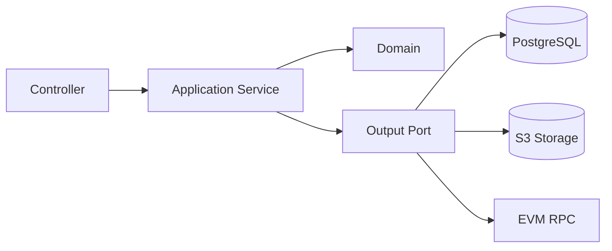
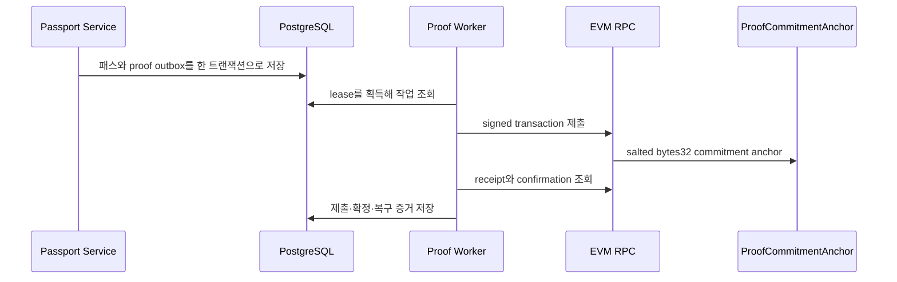

# 내산 백엔드 (Naesan Backend)

[](https://github.com/naesan-project/naesan-backend/actions/workflows/ci.yml)

내산의 계정, 증빙, 패스, 공유, 이전과 EVM 기술적 기록을 담당하는 Spring Boot API입니다.

- 프로젝트 전체 소개: [naesan-project](https://github.com/naesan-project)
- 프론트엔드: [naesan-project/naesan-frontend](https://github.com/naesan-project/naesan-frontend)

## 책임 범위

- JWT access token과 회전 가능한 refresh token 기반 계정 인증
- 증빙 메타데이터·파일의 등록, 확정, 조회와 삭제 수명주기
- 확정된 증빙 스냅샷을 기반으로 한 패스 발급과 조회
- 범위와 만료 시간을 가진 공개 공유 capability 관리
- 공개 파일 일치 확인과 요청별 rate limit
- 패스 이전 상태 전이와 소유 이력 관리
- Transactional Outbox 기반 EVM anchor 제출과 복구
- health, readiness, Prometheus와 구조화 로그 제공

## 아키텍처



도메인별 패키지는 `adapter`–`application`–`domain` 경계를 사용합니다. Controller는 HTTP 계약과 인증 주체 변환을 담당하고, application service는 유스케이스와 트랜잭션을 조정하며, domain 객체는 상태 전이와 불변식을 보유합니다.

```text
com.naesan
├── account/      # 계정 등록, 인증, 삭제 상태
├── evidence/     # 증빙 초안, 파일, 확정 스냅샷
├── passport/     # 패스 발급, 조회, 소유 이력, proof outbox
├── share/        # 공개 공유, scope, 파일 일치 확인
├── transfer/     # 이전 요청과 보유자 변경
├── security/     # JWT, refresh token, CSRF, CORS, 활성 계정 필터
└── operations/   # health, request id, 운영 환경 가드
```

## 핵심 도메인 규칙

### 증빙

- 증빙은 초안 상태에서 메타데이터와 파일을 준비한 뒤 확정합니다.
- 확정 시 변경 불가능한 snapshot을 만들고 패스 발급 입력으로 사용합니다.
- 원본 파일은 S3 호환 비공개 저장소에 저장하고 공개 API에서 직접 노출하지 않습니다.
- 고아 파일과 삭제 예정 파일을 별도 작업으로 정리합니다.

### 공유

- 공개 토큰 원문 대신 검증 가능한 token digest를 저장합니다.
- 기본 정보와 파일 일치 확인 scope를 구분합니다.
- 링크는 기본 7일 후 만료되며 교체 또는 명시적으로 폐기할 수 있습니다.
- 공개 응답에는 구매 금액, 증빙 원본과 전체 식별 정보를 포함하지 않습니다.

### 이전

- 하나의 패스에는 동시에 하나의 `PENDING` 이전 요청만 허용합니다.
- 요청자와 수신자는 동일할 수 없으며 활성 계정만 수신자가 될 수 있습니다.
- 수락 시 패스 보유자 변경, 소유 이력 추가, 이전 상태 갱신과 기존 공유 링크 폐기를 하나의 트랜잭션으로 처리합니다.
- 현재 보유자와 passport version을 재확인해 동시 수락과 보유자 변경 경쟁을 차단합니다.

## 인증과 보안

- 15분 만료 JWT access token을 `Authorization: Bearer` 헤더로 검증
- 30일 refresh token은 `HttpOnly`, `SameSite=Lax` 쿠키로 전달하고 DB에 SHA-256 hash만 저장
- refresh token은 갱신 시 행 잠금 후 1회 사용처리하고 새 token으로 회전
- 로그아웃은 현재 refresh token을, 계정 삭제는 해당 계정의 모든 refresh token을 즉시 폐기
- `/api/csrf`로 `XSRF-TOKEN`을 발급하고 로그인·갱신·로그아웃 요청의 `X-XSRF-TOKEN` 헤더 검증
- 운영 profile에서 refresh token의 Secure 쿠키와 256-bit 이상 JWT secret 강제
- credentials를 허용하는 단일 frontend origin CORS 정책
- 비활성 계정을 차단하는 request filter
- 최대 10MB 증빙·파일 일치 요청 제한
- 공개 검증과 파일 일치 요청별 rate limit
- 신뢰한 reverse proxy가 전달한 client IP별 단일 인스턴스 rate limit
- production profile에서 fake proof provider 사용 방지

## EVM proof 파이프라인



`ProofCommitmentAnchor`는 NFT를 발행하거나 정품 여부를 판정하지 않습니다. 증빙 원본과 개인정보는 온체인에 저장하지 않고 최초 commitment와 anchor 시점만 기록합니다.

EVM adapter는 다음 상태를 구분합니다.

- nonce, gas, estimate 단계의 RPC 실패
- 전송 후 결과를 확정할 수 없는 ambiguous 상태
- 동일 commitment의 중복 anchor 경쟁
- receipt 대기와 confirmation 부족
- chain read-back 불일치
- 설정한 writer와 컨트랙트 writer 불일치

## 기술 스택

| 영역 | 기술 |
| --- | --- |
| Runtime | Java 21, Spring Boot 4.1 |
| Web/Security | Spring MVC, Spring Security, Bean Validation |
| Persistence | PostgreSQL, Spring Data JPA, JDBC, Flyway |
| Storage | AWS SDK for Java, S3-compatible storage, MinIO |
| Web3 | Solidity, Hardhat 3, Web3j 5 |
| Operations | Spring Actuator, Prometheus, structured logging |
| Test | JUnit 5, Spring Test, Testcontainers, Playwright |

## API 그룹

| 영역 | 대표 경로 |
| --- | --- |
| 계정 | `/api/accounts`, `/api/sessions`, `/api/csrf` |
| 증빙 | `/api/evidence` |
| 패스 | `/api/passports` |
| 공유 관리 | `/api/passports/{passportId}/shares` |
| 공개 검증 | `/api/public/passport-verification` |
| 이전 | `/api/passports/{passportId}/transfers`, `/api/transfers/*` |
| 운영 | `/health`, `/ready`, management port의 `/actuator/prometheus` |

정확한 요청·응답 계약은 Controller, request/response DTO와 API integration test를 기준으로 관리합니다.

## 전체 애플리케이션 실행

### 준비 사항

- Docker와 Docker Compose
- `naesan-frontend:local` Docker 이미지

```bash
git clone https://github.com/naesan-project/naesan-backend.git
git clone https://github.com/naesan-project/naesan-frontend.git

cd naesan-backend
cp .env.example .env
docker compose --env-file .env -f compose.local.yaml up --build
```

- 애플리케이션: `http://localhost:8080`
- 프론트엔드 health: `http://localhost:8080/health`
- 백엔드 readiness: `http://localhost:8080/ready`

`compose.local.yaml`은 HTTP origin과 비보안 refresh cookie를 사용하는 로컬 전용 구성으로 PostgreSQL, MinIO, Spring Boot API와 프론트엔드 Nginx를 실행합니다. 운영 환경은 `production` profile과 HTTPS origin, Secure refresh cookie를 사용하며 이후 배포 플랫폼 설정에서 별도로 구성합니다. `.env.example`은 로컬 예시이며 실제 비밀번호, RPC URL, 개인 키와 클라우드 자격 증명을 커밋하면 안 됩니다.

기본 frontend build context는 형제 경로인 `../naesan-frontend`입니다. 다른 위치에 clone했다면 `.env`의 `NAESAN_FRONTEND_CONTEXT`를 해당 경로로 변경합니다.

## 주요 환경변수

| 변수 | 용도 |
| --- | --- |
| `NAESAN_DB_*` | PostgreSQL 연결 |
| `NAESAN_FRONTEND_ORIGIN` | CORS 허용 origin |
| `NAESAN_AUTH_JWT_SECRET` | Base64로 인코딩한 256-bit 이상 JWT 서명 key |
| `NAESAN_TRUSTED_PROXY_CIDRS` | client IP 전달을 신뢰할 reverse proxy CIDR 목록 |
| `NAESAN_S3_*` | 비공개 증빙 저장소 |
| `NAESAN_PROOF_PROVIDER` | `unconfigured`, `fake`, `evm` provider 선택 |
| `NAESAN_PROOF_WORKER_ENABLED` | proof worker 실행 여부 |
| `NAESAN_EVM_RPC_URL` | EVM JSON-RPC endpoint |
| `NAESAN_EVM_CHAIN_ID` | 대상 chain id |
| `NAESAN_EVM_CONTRACT_ADDRESS` | 배포한 anchor contract |
| `NAESAN_EVM_PRIVATE_KEY` | backend writer 개인 키 |
| `NAESAN_EVM_DEPLOYMENT_BLOCK` | chain 복구 조회 시작 block |
| `NAESAN_EVM_REQUIRED_CONFIRMATIONS` | 확정에 필요한 confirmation 수 |

Compose 기본값은 proof provider `unconfigured`, worker 비활성입니다. 실제 EVM 제출은 모든 EVM 환경변수를 설정한 경우에만 활성화해야 합니다.

## 검증

```bash
# Spring 및 도메인 통합 테스트
./gradlew test --no-daemon

# Solidity contract
cd contracts
npm ci
npm run typecheck
npm test
npm run build

# Java ↔ 로컬 EVM 통합 테스트
cd ..
./gradlew evmTest --no-daemon

# 브라우저 E2E
cd e2e
npm ci
npm run install:browser
npm test

# 깨끗한 임시 Compose에서 가입→발급→공유→이전 smoke
cd ..
bash operations/verify-local-compose.sh
```

현재 기본 Spring test suite는 374개 테스트를 포함합니다. GitHub Actions는 contract 검증, Spring 테스트, 로컬 EVM 통합 테스트, local Compose 설정과 production Docker 이미지 빌드를 검증합니다. 수동 실행에서는 프론트엔드까지 포함한 전체 Compose browser smoke를 추가로 선택할 수 있습니다.

## 스마트 컨트랙트 배포

로컬 체인과 Sepolia 배포 명령, writer 분리와 필요한 환경변수는 [contracts/README.md](contracts/README.md)를 참고하세요.

Sepolia 배포 스크립트는 production compiler profile을 사용하고 대상 chain을 검증합니다. 개인 지갑 키를 backend writer 또는 deployer 키로 재사용하지 마세요.

## 운영 특성

- `/health`, `/ready` liveness/readiness probe
- readiness에 database 상태 포함
- management port에서 Prometheus metric 제공
- request id를 MDC에 기록
- production console log를 Logstash JSON 형식으로 출력
- production profile의 잘못된 origin, storage, proof 설정을 시작 시점에 차단
- 현재 rate limit 상태는 애플리케이션 인스턴스 메모리에 있어 수평 확장 시 외부 저장소 또는 gateway가 필요

## 현재 한계

- 공개 클라우드 운영 환경과 도메인은 아직 구성하지 않았습니다.
- Sepolia 실제 컨트랙트 주소와 트랜잭션 증거가 없습니다.
- 외부 정품 판정 기관과 연동하지 않습니다.
- 제품 대표 이미지와 브랜드·모델 등 일부 표시용 정보는 패스 응답에 영속화되지 않습니다.
- 중앙 로그 수집, 알림, 백업과 자동 배포가 필요합니다.

## 라이선스

라이선스는 아직 결정하지 않았습니다.
