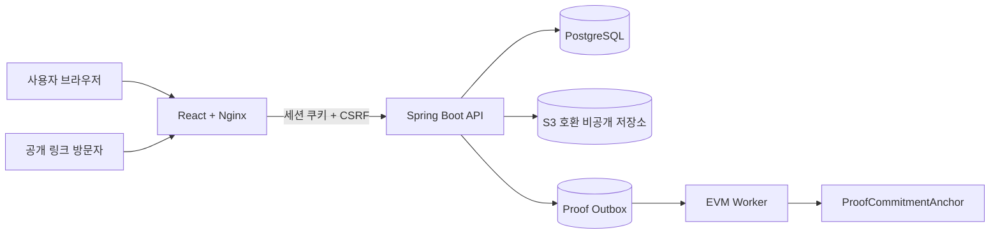

# 내산 백엔드 (Naesan Backend)

[](https://github.com/naesan-project/naesan-backend/actions/workflows/ci.yml)

내산은 제품 정보와 구매 증빙을 하나의 **패스**로 묶어 기록하고, 필요한 정보만 공유하거나 새로운 보유자에게 이전할 수 있는 서비스입니다.


> **현재 상태**
>
> 핵심 MVP, 프론트엔드–백엔드 통합, 로컬 EVM 스마트 컨트랙트 검증까지 구현했습니다. 공개 클라우드 배포와 Sepolia 실제 트랜잭션은 아직 진행하지 않았습니다.

프론트엔드 저장소: [naesan-project/naesan-frontend](https://github.com/naesan-project/naesan-frontend)

## 해결하려는 문제

고가 제품의 제품 정보, 구매 증빙, 공유 기록과 보유 이력은 서로 분리되기 쉽습니다. 내산은 다음 흐름을 하나의 패스로 연결합니다.

1. 제품 정보와 구매 증빙 등록
2. 확정된 증빙 스냅샷으로 패스 발급
3. 공개 범위를 제한한 링크 공유
4. 상대방이 보유한 파일과 등록 기록의 일치 여부 확인
5. 다른 내산 계정으로 패스 이전
6. 증빙 commitment를 EVM에 기록하고 변경 여부 확인

내산의 Web3 기능은 제품의 진품 여부를 판정하지 않습니다. 증빙 원본이나 개인정보를 체인에 저장하지 않고, salted `bytes32` commitment를 사용해 등록 이후 기록이 변경되지 않았는지 확인합니다.

## 주요 기능

- 세션 쿠키와 CSRF 토큰을 사용하는 회원가입·로그인·로그아웃·계정 조회
- 증빙 초안 생성, 메타데이터 수정, 파일 업로드, 확정, 다운로드
- 패스 발급, 목록·상세 조회, 기술적 기록 상태 확인
- 7일 만료 공개 링크 생성·교체·중지
- 공개 범위에 따른 기본 정보 조회와 파일 일치 확인
- 패스 이전 요청, 수락, 거절, 취소 및 소유 이력 관리
- 패스 이전 완료 시 기존 공개 링크 자동 폐기
- Transactional Outbox 기반 EVM 제출, 재시도, confirmation 확인 및 복구
- 운영 헬스체크, Prometheus 메트릭, 구조화 로그

## 아키텍처



백엔드는 계정, 증빙, 패스, 공유, 이전을 독립된 도메인으로 나누고 각 도메인 안에서 `adapter`–`application`–`domain` 경계를 유지합니다.

## 주요 기술적 선택

### 세션 인증과 CSRF

브라우저 클라이언트는 `HttpOnly` 세션 쿠키를 사용합니다. 변경 요청은 `/api/csrf`에서 받은 토큰을 `X-XSRF-TOKEN` 헤더로 전달하며, 운영 환경에서는 Secure 쿠키를 강제합니다.

### 증빙과 공개 정보 분리

증빙 원본은 S3 호환 비공개 저장소에 보관합니다. 공개 패스에는 구매 금액, 원본 파일, 전체 식별 정보를 노출하지 않으며 공유 scope에 포함된 정보만 반환합니다.

### 비동기 온체인 기록

패스 발급 트랜잭션과 EVM 제출을 분리하기 위해 Transactional Outbox를 사용합니다. RPC 사전 실패, 전송 결과가 불명확한 경우, 중복 anchor 경쟁, confirmation 대기와 writer 불일치를 각각 구분해 처리합니다.

### 안전한 패스 이전

이전 수락 시 현재 보유자와 버전을 다시 확인하고, 패스 보유자 변경·소유 이력 추가·기존 공유 링크 폐기를 하나의 트랜잭션으로 처리합니다.

## 기술 스택

| 영역 | 기술 |
| --- | --- |
| Application | Java 21, Spring Boot 4.1, Spring Security |
| Persistence | PostgreSQL, Spring Data JPA, JDBC, Flyway |
| File storage | AWS SDK for Java, S3-compatible storage, MinIO |
| Web3 | Solidity, Hardhat 3, Web3j 5 |
| Operations | Spring Actuator, Prometheus, structured logging |
| Test | JUnit 5, Spring Integration Test, Testcontainers, Playwright |
| Runtime | Docker, Docker Compose |

## 로컬 실행

### 준비 사항

- Docker와 Docker Compose
- 프론트엔드 이미지를 만들기 위한 Node.js 24 또는 Docker
- 저장소 두 개를 같은 작업 디렉터리에 clone하는 구성을 권장합니다.

```bash
git clone https://github.com/naesan-project/naesan-backend.git
git clone https://github.com/naesan-project/naesan-frontend.git

cd naesan-frontend
docker build -t naesan-frontend:local .

cd ../naesan-backend
cp .env.example .env
docker compose up --build
```

실행 후 확인할 수 있는 주소입니다.

- 애플리케이션: `http://localhost:8080`
- 프론트엔드 상태: `http://localhost:8080/health`
- 애플리케이션 준비 상태: `http://localhost:8080/ready`

`.env.example`의 값은 로컬 실행용 예시입니다. 운영 비밀번호, RPC URL, 개인 키와 클라우드 자격 증명을 Git에 추가하지 마세요.

## Web3 검증

스마트 컨트랙트는 NFT를 발행하거나 정품을 판정하지 않습니다. 최초 anchor 시점과 commitment만 기록하며, 쓰기 권한은 배포 시 지정한 immutable writer 주소로 제한합니다.

```bash
cd contracts
npm ci
npm run typecheck
npm test
npm run build
```

로컬 배포와 Sepolia 배포 환경변수는 [contracts/README.md](contracts/README.md)를 참고하세요. Compose의 기본값은 `NAESAN_PROOF_PROVIDER=unconfigured`, `NAESAN_PROOF_WORKER_ENABLED=false`이므로 실제 EVM 제출은 명시적인 설정이 필요합니다.

## 테스트

```bash
# Spring 및 도메인 통합 테스트
./gradlew test --no-daemon

# 로컬 체인 통합 테스트
./gradlew evmTest --no-daemon

# 브라우저 E2E
cd e2e
npm ci
npm run install:browser
npm test
```

GitHub Actions는 스마트 컨트랙트 검증, Spring 테스트, 로컬 체인 통합 테스트와 production Docker 이미지 빌드를 실행합니다.

## API 영역

| 영역 | 대표 경로 |
| --- | --- |
| 인증 | `/api/accounts`, `/api/sessions`, `/api/csrf` |
| 증빙 | `/api/evidence` |
| 패스 | `/api/passports` |
| 공유·검증 | `/api/passports/{id}/shares`, `/api/public/passport-verification` |
| 이전 | `/api/passports/{id}/transfers`, `/api/transfers/*` |
| 운영 | `/health`, `/ready`, management port의 `/actuator/prometheus` |

정확한 요청·응답 계약은 Controller와 DTO, 통합 테스트를 기준으로 관리합니다.

## 현재 한계

- 공개 서비스 URL과 클라우드 운영 환경은 아직 없습니다.
- Sepolia 컨트랙트 실제 배포와 트랜잭션 증거는 아직 생성하지 않았습니다.
- 외부 정품 판정 기관과 연동하지 않습니다.
- 중앙 로그 수집, 알림, 백업과 자동 배포는 배포 단계에서 추가해야 합니다.
- 제품 대표 이미지와 일부 표시용 정보는 현재 백엔드 패스 모델에 영속화되지 않습니다.

## 라이선스

라이선스는 아직 결정하지 않았습니다. 사용 또는 배포 전에 저장소 관리자의 허가가 필요합니다.
