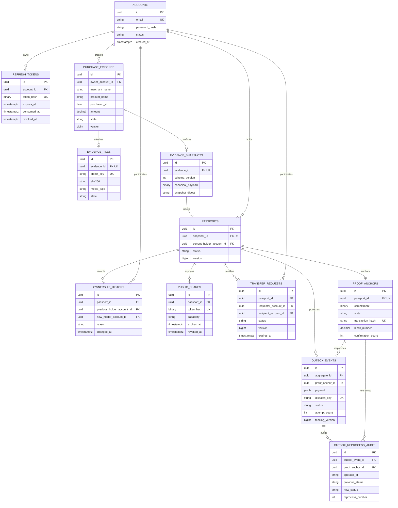

# 내산 데이터 모델

내산은 구매 증빙을 확정된 snapshot으로 고정한 뒤 패스를 발급합니다. 패스의 현재 보유자와 전체 소유 이력을 분리하고, 공개 공유·이전 요청·EVM 제출을 패스에 연결합니다.

## 설계 포인트

- 구매 증빙 원본 파일과 확정 snapshot을 분리해 패스가 변경 불가능한 발급 시점 데이터를 참조합니다.
- `passports.current_holder_account_id`는 현재 조회를 담당하고 `ownership_history`는 발급·이전 이력을 보존합니다.
- 공개 공유에는 capability token의 SHA-256 digest만 저장하며 원문 token은 저장하지 않습니다.
- 패스와 `outbox_events`는 같은 DB transaction에서 생성되고 EVM 제출 결과는 `proof_anchors`에 기록됩니다.
- 부분 unique index와 version·상태 제약으로 동시 공유·이전·Outbox 처리 경쟁을 보호합니다.

정확한 컬럼, check constraint와 index의 기준은 [`src/main/resources/db/migration`](../../src/main/resources/db/migration)입니다.
